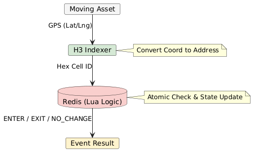
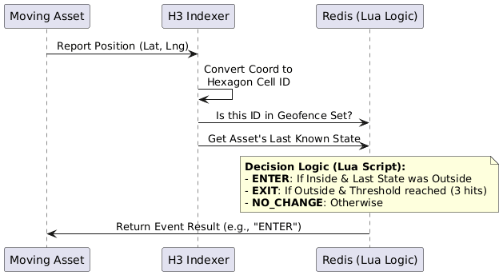

# Real-Time High Performance Geofence Monitoring Solution

## Redis + H3 Grid Indexing

## 🚀 Overview

This project is a **real-time geofence monitoring system** optimized for **high throughput**, **low latency**, and **horizontal scalability**.

It replaces traditional geometry-heavy spatial checks with **grid-based addressing** using **H3 hexagonal indexing** and **Redis atomic logic**.

The result is a system capable of handling **tens of thousands of location updates per second** with reliable **ENTER / EXIT detection**, even under noisy GPS conditions.

---

## 🛑 The Problem: Point-in-Polygon Bottleneck

Traditional geofencing systems rely on **Point-in-Polygon (Ray Casting)** algorithms. While mathematically correct, they do not scale well.

### ❌ Limitations of Traditional Approaches

#### 1. High Computational Cost

* Complexity: **O(V)** per check (V = polygon vertices)
* Thousands of assets × complex polygons = **CPU overload**

#### 2. Database Stress

* Relational databases struggle with highly dynamic spatial queries
* High disk I/O and increasing latency under load

#### 3. GPS Jitter & False Alerts

* Small GPS inaccuracies cause rapid ENTER / EXIT flickering
* Leads to alert spam and unreliable monitoring

---

## ✅ The Solution: Grid-Based Spatial Indexing

This system shifts from **geometry-based computation** to **address-based lookup**.

Instead of asking:

> *Is this point inside this polygon?*

We ask:

> *Is this H3 cell ID in the geofence set?*

---

## 🧠 System Architecture





---

## 🔷 Core Design Principles

### 1. Hexagonal Quantization (H3)

Instead of checking raw coordinates against polygon edges, the world is divided into **hexagonal cells**.

* Geofences are preprocessed into **H3 Cell ID sets**
* Runtime checks become simple **key lookups**

**Result**:

* Spatial complexity drops from **O(V)** to **O(1)**
* Massive improvement in throughput

---

### 2. Atomic Logic with Redis & Lua

All decision-making logic runs inside Redis using Lua scripts.

* **Atomic execution** → No race conditions
* **Stateless services** → Horizontal scalability
* **Zero extra network round-trips** for state transitions

Redis stores:

* Asset states
* Hysteresis counters
* Geofence cell sets

---

### 3. Spatial Hysteresis

To handle GPS noise, the system uses a **consecutive-hit threshold**.

* EXIT events require *N* consecutive outside detections
* Prevents ENTER / EXIT flickering near boundaries

This significantly improves signal quality and alert reliability.

---

## 📊 Expected Performance

| Metric         | Legacy (PostGIS / Turf) | H3 + Redis System   |
| -------------- | ----------------------- | ------------------- |
| Spatial Check  | O(V)                    | O(1)                |
| Throughput     | ~500 events/sec         | 50,000+ events/sec  |
| Data Structure | Complex Geometry        | Redis Sets & Hashes |
| Scalability    | Vertical                | Horizontal          |

---

## 🛠️ Tech Stack

* **Node.js / TypeScript**
* **Redis**
* **H3 (Hexagonal Indexing)**
* **Docker & Docker Compose**

---

## ▶️ Setup & Run

No local installation required.

```bash
docker-compose up --build
```

---

## ⚙️ What Happens Automatically

### 1. Redis Initialization

* Redis instance starts

### 2. Geofence Preparation

* Beşiktaş / Istanbul polygon is:

  * Converted into H3 cells
  * Stored as a Redis Set

### 3. Simulation

* A vehicle route is simulated
* System logs:

  * ENTER
  * INSIDE
  * EXIT events

---

## ✅ Summary

This architecture demonstrates how **address-based spatial indexing**, combined with **in-memory atomic logic**, can outperform traditional GIS approaches by orders of magnitude in real-time systems.

It is especially suitable for:

* Fleet tracking
* Critical asset monitoring
* High-frequency IoT location streams
* Large-scale geofence alerting systems
